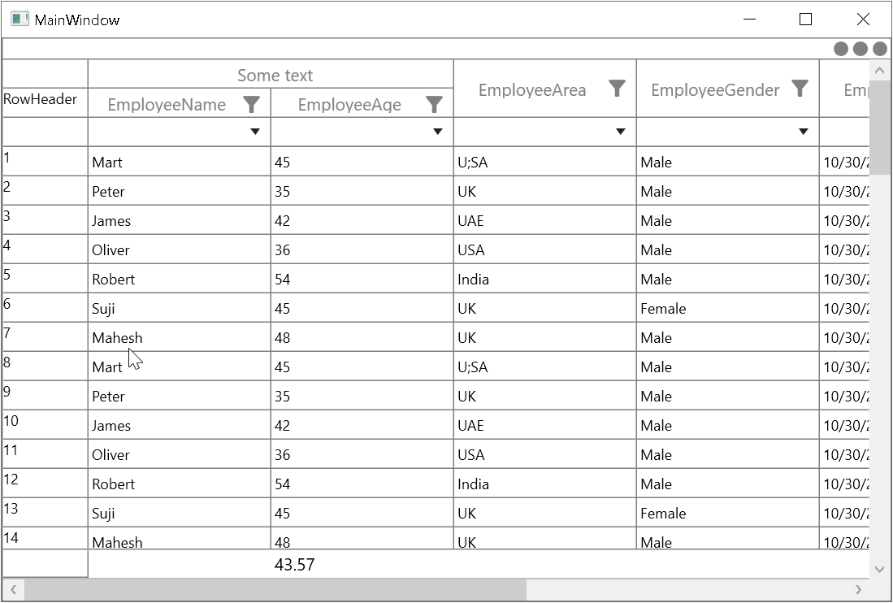

# How to Show Row Index in Row Header in WPF DataGrid?

This sample illustrates how to show row index in row header in the [WPF DataGrid](https://www.syncfusion.com/wpf-controls/datagrid) (SfDataGrid).

`DataGrid` consider the [GridSummaryRow](https://help.syncfusion.com/cr/wpf/Syncfusion.UI.Xaml.Grid.GridSummaryRow.html) and [StackedHeaderRow](https://help.syncfusion.com/cr/wpf/Syncfusion.UI.Xaml.Grid.StackedHeaderRow.html) while getting the data row index. You can avoid these rows by adding the converter to Text property of TextBlock.

#### XAML
``` xml
<Style TargetType="syncfusion:GridRowHeaderCell">
    <Setter Property="Background" Value="Transparent" />
    <Setter Property="BorderBrush" Value="Gray" />
    <Setter Property="BorderThickness" Value="0,0,1,1" />
    <Setter Property="Padding" Value="0,0,0,0" />
    <Setter Property="FontFamily" Value="Segoe UI" />
    <Setter Property="FontSize" Value="12" />
    <Setter Property="FocusVisualStyle" Value="{x:Null}" />
    <Setter Property="IsTabStop" Value="False" />
    <Setter Property="Template">
        <Setter.Value>
            <ControlTemplate TargetType="syncfusion:GridRowHeaderCell">
                <Border
                    x:Name="PART_RowHeaderCellBorder"
                    Background="{TemplateBinding Background}"
                    BorderBrush="{TemplateBinding BorderBrush}"
                    BorderThickness="{TemplateBinding BorderThickness}">
                    <Grid>
                        <TextBlock Text="{Binding RowIndex, RelativeSource={RelativeSource TemplatedParent}, Converter={StaticResource rowIndexValueconverter}}" />
                    </Grid>
                </Border>

            </ControlTemplate>
        </Setter.Value>
    </Setter>
</Style>
```

#### C#
```c#
public class RowIndexValueConverter : IValueConverter
{
    SfDataGrid dataGrid = Application.Current.MainWindow.FindName("sfDataGrid") as SfDataGrid;

    public object Convert(object value, Type targetType, object parameter, CultureInfo culture)
    {
        int firstRowIndex = dataGrid.GetFirstDataRowIndex();
        int lastRowIndex = dataGrid.GetLastDataRowIndex();
        if (value == null || (int)value > lastRowIndex || (int)value < firstRowIndex)
            return string.Empty;
        return (int)value - firstRowIndex + 1;
    }

    public object ConvertBack(object value, Type targetType, object parameter, CultureInfo culture)
    {
        throw new NotImplementedException();
    }
}
```



## Requirements to run the demo
 Visual Studio 2015 and above versions